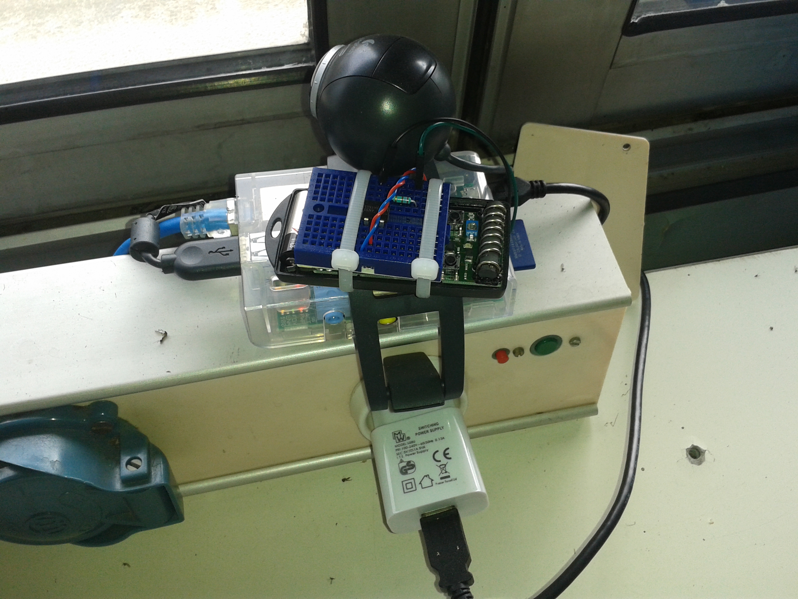

rpi.gate_guardian
=================

Gate Guardian : webcam + remote command + web site on a Raspberry Pi

Use Rpi GPIO 7 to set an optocoupler to trigger a remote unit.

Just point you browser to the IP of the Pi you can see an MJPEG stream with a
button to open the door.

See install.txt for setup the Rpi.
